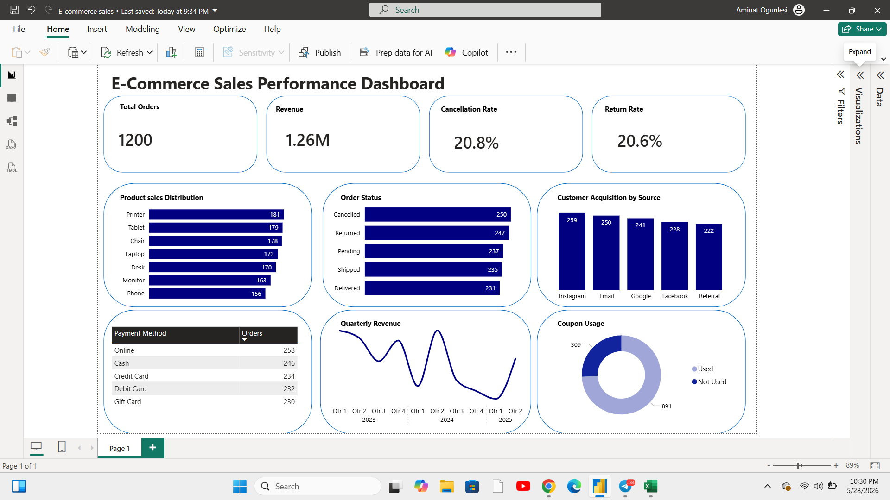

# E-Commerce Sales Performance Analysis

## Project Overview
This project involves cleaning, analyzing, and visualizing an e-commerce sales dataset of 1,200 orders spanning January 2023 to June 2025. The goal was to transform raw data into actionable business intelligence.

## Tools Used
- Microsoft Excel — Data cleaning and EDA
- Power BI — Interactive dashboard and visualizations

## Project Structure
-  Raw Data
-  Cleaned Data
-  Change Summary (Data Cleaning Report)
-  DA Report
## Week 1: Data Cleaning
- Checked and confirmed zero duplicate Order IDs and Tracking Numbers
- Replaced 309 blank Coupon Code values with N/A
- Reformatted all 14 columns from General to correct data types
- Verified Total Price accuracy (Quantity × Unit Price)

## Week 2: Exploratory Data Analysis (EDA)
### Key Findings
- 📦 Total Orders: 1,200
- 💰 Total Revenue: 1,264,761.96
- 🛒 Average Order Value: 1,053.97
- ❌ Cancellation Rate: 20.8%
- 🔄 Return Rate: 20.6%

### Insights
- Printer is the best selling product (182 orders)
- Instagram is the top customer acquisition channel (259 customers)
- 74% of customers used a coupon code, indicating high price sensitivity
- Over 40% of orders were cancelled or returned, a critical business concern
- 2023 recorded the highest annual revenue at 552,643
- Q4 2024 was the weakest quarter at 108,426

## Recommendations
1. Reduce Cancellation & Return Rate — Investigate root causes such as pricing, delivery time or misleading product descriptions. Improving product information could significantly reduce returns.
2. Address Coupon Dependency — 74% coupon usage suggests customers rarely buy at full price. Gradually reduce discounting and introduce a loyalty program to retain customers without heavy discounts.
3. Investigate Q4 2024 Revenue Drop — Q4 2024 was the weakest quarter. A deeper investigation is needed and targeted promotions should be planned ahead of Q4 2025.
4. Double Down on Instagram — Instagram is the top acquisition channel. Increasing investment here while reviewing underperforming channels like Referral and Facebook could improve customer acquisition efficiency.
5. Review Phone Product Strategy — Phone is the least sold product. Consider revising pricing, improving marketing or bundling with accessories to boost sales.

## Data Story: What the Data Is Telling Us

The Business at a Glance
Between January 2023 and June 2025, this e-commerce business processed 
1,200 orders generating a total revenue of 1,264,761.96. On average, 
each customer spent 1,053.97 per order, ordering approximately 3 items 
at a time.

The Revenue Story
2023 was the strongest year with 552,643 in revenue. 2024 saw a 13% 
decline to 480,235. While 2025 appears lower at 231,882, this only 
represents the first 6 months — making it broadly comparable to prior 
years on a monthly basis.

The Hidden Problem
Over 40% of all orders were either cancelled (20.8%) or returned (20.6%). 
For every 10 orders placed, 4 never resulted in a successful delivery, 
a critical issue that directly impacts revenue and customer trust.

The Coupon Dependency
74% of customers used a coupon code. Only 1 in 4 customers paid full 
price — raising serious questions about long term profit margins.

The Marketing Insight
Instagram is the top acquisition channel (259 customers), followed by 
Email (250). The business has a healthy spread across all channels.

The Product Story
Printer had the most orders (182) but Chair generated the highest revenue, meaning Chair commands a significantly higher price point despite lower 
sales volume.

This business has strong revenue potential but is being held back by high 
cancellation rates and coupon dependency. Fixing these two issues alone 
could dramatically improve profitability.

## Dashboard

## How to Use
1. Open the Excel file to view raw data, cleaned data and EDA report
2. Open the .pbix file in Power BI Desktop to interact with the dashboard

## Author
Aminat Ogunlesi — Data Analysis Intern
